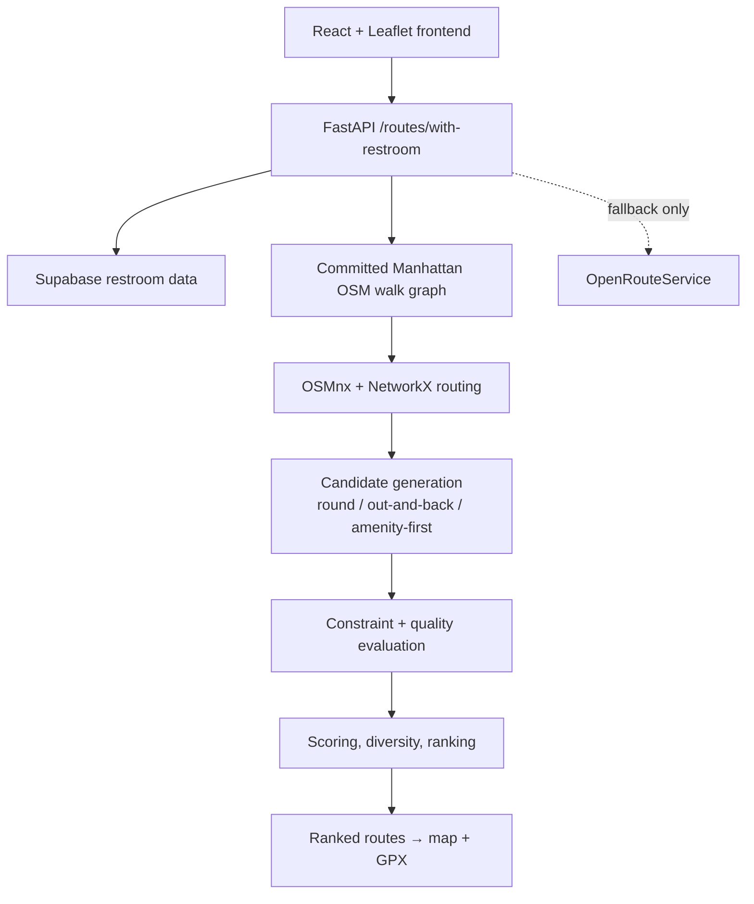

# Aware

A Manhattan running/walking route planner with a custom local routing engine — routes are generated to hit a target distance, pass a restroom in a requested mile range (falling back to a water fountain when no restroom match is available), and match a shape and elevation preference, then ranked and returned with GPX export.

<!-- TODO: add product demo GIF -->

Runners planning longer routes often have to manually cross-reference maps, restroom locations, and distance estimates. Aware treats restroom access as a routing constraint instead of a map overlay, generating routes that are built around it from the start.

<!-- TODO: add live demo URL once verified -->
GitHub: [Oryag910/Aware-Route](https://github.com/Oryag910/Aware-Route)

## What it does

- Target running/walking distance, tuned toward the requested value
- Requested restroom mile range (e.g. "a restroom between mile 4 and 6")
- Route shape: round trip, out-and-back, or mixed
- Elevation preference: flat, moderate, hilly, or any
- Ranked route alternatives, not just a single result
- Restroom or water-fountain info attached to each route, with distinct map markers
- GPX export for use in other running/GPS apps

## How it works



The local engine (OSMnx + NetworkX against a committed graph artifact) is the production-primary path. OpenRouteService is wired in as fallback infrastructure — used only if the local graph fails to load or a request hits an unexpected local-engine error — not part of the normal request path.

## Routing engine

This is the core of the project, not a wrapper around a third-party directions API.

- A Manhattan pedestrian walk graph is built from OpenStreetMap data via OSMnx and committed as a graph artifact, so the app loads it once at startup instead of fetching/building a graph per request.
- Shortest-path and distance computations run on that graph with NetworkX (Dijkstra-based).
- Custom generators produce round-trip, out-and-back, and amenity-first (routed through a restroom/fountain) candidates.
- A length-tuning pass drives candidates toward the requested target distance.
- Candidates are evaluated against the requested restroom mile range and elevation preference, then ranked using shape fit, pedestrian-path share, signal interruptions, elevation, retracing, amenity proximity, and route similarity.
- Quality guards reject severely retraced candidates that would violate the requested route shape (e.g. a "round" request degenerating into a near out-and-back).
- Final candidates are deduplicated and similarity-penalized to reduce near-duplicate alternatives.

## Validation

The backend ships with a deterministic local-engine benchmark; the full report is checked into the repo at [`backend/benchmarks/local/report_20260819_132346.md`](backend/benchmarks/local/report_20260819_132346.md).

| Metric | Result |
|---|---|
| Scenarios with ≥1 route within ±100 m of target | **537 / 537** |
| Generated candidates inspected | **2,519** |
| Disconnected candidates | **0** |
| Median local route generation time | **~0.25 s** |
| p95 local route generation time | **~1.29 s** |
| Max local route generation time | **~2.60 s** |
| Offline bundled-fountain placement checks | **268 / 268** |

The 537/537 figure is scenario-level success (at least one qualifying route per scenario), not a claim that every one of the 2,519 generated candidates individually landed within ±100 m. The fountain-placement figure validates against the offline bundled fountain dataset, not live Supabase restroom data — see the report for the full defect-rate and diversity breakdown.

## Tech stack

**Backend:** Python, FastAPI, OSMnx, NetworkX, Supabase, pytest, Ruff, mypy (strict)

**Frontend:** React 19, TypeScript, Vite, Leaflet / react-leaflet, Tailwind CSS

**Infrastructure:** Render (backend), Vercel (frontend), GitHub Actions CI, OpenRouteService (fallback only)

## Local development

### Backend

```bash
cd backend
python3 -m venv .venv
source .venv/bin/activate
pip install -r requirements.txt
uvicorn app.main:app --reload --reload-dir app
```

Health check: `http://localhost:8000/health`

Environment variables (`backend/.env`):

- `SUPABASE_URL`, `SUPABASE_KEY` — required for restroom data
- `ROUTING_ENGINE=local` — runs the local OSMnx/NetworkX engine (production default); unset or `ors` uses the OpenRouteService pipeline instead
- `ORS_API_KEY` — only required when `ROUTING_ENGINE=ors`, or to keep the local engine's fallback path functional
- `ALLOWED_ORIGINS` — comma-separated CORS origins; unset means no CORS headers (fine for local dev via the Vite proxy)

### Frontend

```bash
cd frontend
npm install
npm run dev
```

Runs at `http://localhost:5173`, proxying `/api/*` to the local backend in dev.

## Testing & CI

GitHub Actions runs on every PR and push to `main`:

- Backend: `pytest`, `ruff check`, `mypy` (strict)
- Frontend: `eslint`, production `vite build`

## Deployment

- **Frontend** is deployed on Vercel from `frontend/`, with `VITE_API_URL` pointed at the backend.
- **Backend** is deployed on Render via `render.yaml` (Docker), with `ROUTING_ENGINE=local` set so the local engine is the production path; `ORS_API_KEY` remains configured for fallback.
- `ALLOWED_ORIGINS` on the backend must include the deployed frontend origin for CORS to work.
- The public demo is rate-limited (per-IP and global) to keep it usable at low cost.

## Limitations

- Currently scoped to Manhattan only.
- Public restroom data can be incomplete, outdated, or wrong about hours/availability.
- Routes are distance-tuned within a tolerance, not guaranteed-exact.
- No live turn-by-turn navigation or run tracking.
- The benchmark validates graph-network routing correctness and offline fountain placement; it does not independently verify every crossing, ferry, or water-adjacency condition beyond what the committed walk graph encodes.
