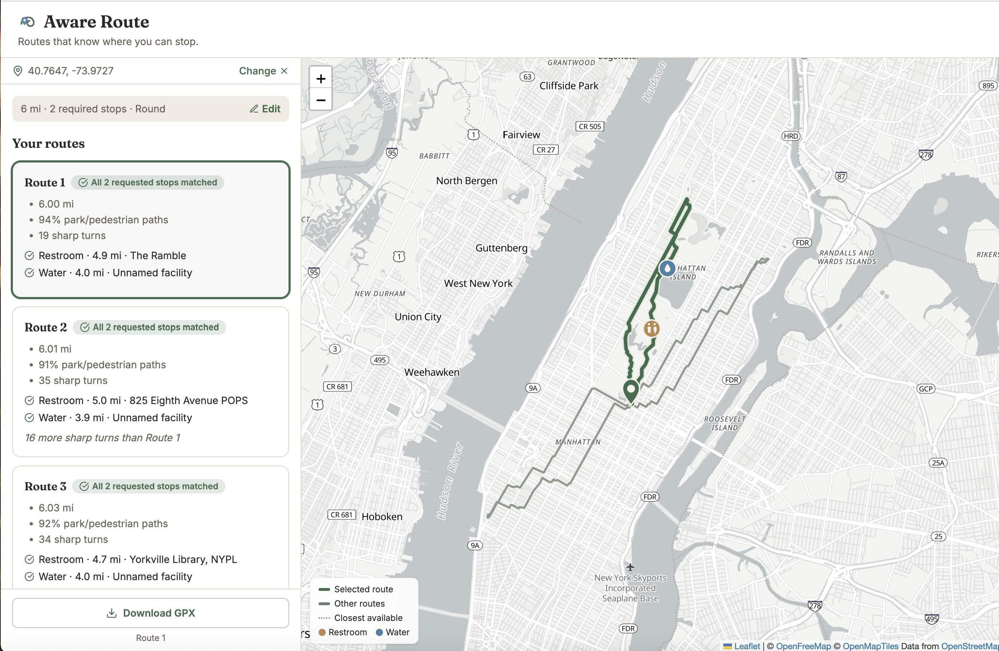
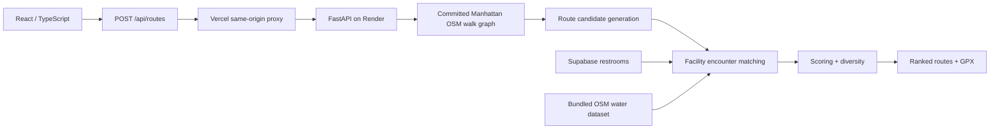

# Aware Route

A Manhattan running-route planner that treats restroom and water stops as hard routing constraints, built on a custom OSMnx/NetworkX graph engine, not a wrapper around a directions API.

**[Live demo →](https://aware-route-ashen.vercel.app)**



Runners planning a longer route usually cross-reference a map, a facility locator, and a distance estimate by hand. Aware Route folds all three into one request, e.g. "6 miles, a restroom around mile 3-5, water around mile 3-4," and returns several ranked routes built around those stops instead of filtered for them afterward.

## What it does

- Pick a start point, target distance, and route shape (round trip, out-and-back, or mixed)
- Optionally require restroom and/or water stops, each with its own cumulative-mile window
- Get back several ranked route alternatives instead of a single result
- See exactly which requested stop each route satisfies, and at what mile marker
- Export any route as a GPX file for another running/GPS app

## Engineering highlights

**Custom graph routing.** A Manhattan pedestrian graph is built from OpenStreetMap via OSMnx and committed as a versioned, checksum-validated artifact, so the app loads it once at startup instead of rebuilding it per request. Shortest-path and distance computations run directly on that graph with NetworkX's Dijkstra implementation; there's no third-party directions API in this path.

**Distance-constrained generation.** Shortest path alone doesn't produce a 5-mile loop, it produces the shortest path. Custom generators build round-trip, out-and-back, and multi-anchor polygon-loop candidates, then a tuning pass pulls each one toward the requested distance, with quality guards that reject candidates that quietly degenerate (e.g. a "round" request collapsing into a near out-and-back).

**Cumulative-mile facility constraints.** A harder problem than it sounds: "a restroom between mile 2 and 4" only counts if it's encountered on the *finished route*, inside that window, measured by cumulative distance rather than proximity to the start. Each facility is projected onto the route's geometry and grouped into distinct encounters, so a facility passed twice on an out-and-back counts as two real chances. A min-cost bipartite matching then deterministically assigns encounters to requirements. A route is "fully valid" only if every requirement is satisfied this way; partial matches are labeled as such, not upgraded to look complete.

**Ranking and diversity.** The planner scores an ordinary candidate pool against the constraints first, since that's far cheaper than constrained search. When that's not enough, a bounded beam search proposes candidates that route through the required facilities directly. The final alternatives are deduplicated by route-segment overlap so the ranked list isn't three near-identical loops.

## Architecture



## Validation

The backend ships with deterministic benchmark suites, re-run against the current code and committed here.

**Core engine**: 537 deterministic round / out-and-back / mixed scenarios, including bundled-fountain amenity cases:

| Metric | Result |
|---|---|
| Scenarios with ≥1 route within ±100 m | 537/537 |
| Disconnected candidates | 0 |
| Median / p95 generation latency | 0.318 s / 1.543 s |
| Scenarios with a meaningfully distinct alternative | 100% |
| Offline fountain-placement checks | 268/268 |

Full report: [`backend/benchmarks/local/report_20260828_125029.md`](backend/benchmarks/local/report_20260828_125029.md)

**Route-count reliability**: at the product default of 3 requested alternatives, across the same 537 scenarios, 100% of scenarios returned exactly 3 routes, and 99.8% had all three within ±100 m of target (99.9% of individual candidates were within tolerance). Full report: [`backend/benchmarks/local/count_reliability_20260828_121412.md`](backend/benchmarks/local/count_reliability_20260828_121412.md)

**Facility constraint satisfaction**: two suites test routing through specific facilities inside requested mile windows:

- *Mechanism correctness* (117 scenarios, fixtures placed on a route's own geometry so a solution is guaranteed to exist): 117/117 fully constraint-valid across 0 to 6 simultaneous requirements. This confirms the encounter-matching and assignment logic is correct; it says nothing about whether an arbitrary facility layout is solvable.
- *Real water-data coverage* (12 scenarios against the actual bundled water dataset, no synthetic placement): 12/12 fully satisfied, 18/18 individual requirements found.

A separate stress suite places facilities specifically to force the constrained planner rather than any natural route: a single hard requirement is recovered 18/18 times, but two or more simultaneous hard requirements aren't reliably solved today (see [Limitations](#limitations)). Full report: [`backend/benchmarks/facilities/report_20260828_130248.md`](backend/benchmarks/facilities/report_20260828_130248.md)

## Technical docs

- [Architecture](docs/architecture.md): how a request becomes a ranked set of routes
- [Benchmarks](docs/benchmarks.md): methodology behind the numbers above
- [Deployment](docs/deployment.md): production and PR-preview infrastructure

## Tech stack

**Backend:** Python, FastAPI, OSMnx, NetworkX, Supabase, pytest, Ruff, mypy (strict)

**Frontend:** React 19, TypeScript, Vite, Leaflet / react-leaflet, MapLibre GL, OpenFreeMap, Tailwind CSS

**Infrastructure:** Vercel (frontend), Render (backend), GitHub Actions CI

## Local development

**Backend**

```bash
cd backend
python3 -m venv .venv && source .venv/bin/activate
pip install -r requirements.txt
uvicorn app.main:app --reload --reload-dir app
```

Needs `SUPABASE_URL` / `SUPABASE_KEY` for restroom data (only fetched when a request includes a restroom). Water data is a committed dataset, so it needs no extra config.

**Frontend** (Node 22, see [`.nvmrc`](.nvmrc))

```bash
cd frontend
npm install
npm run dev
```

Runs at `http://localhost:5173`, proxying `/api/*` to the local backend.

GitHub Actions runs `pytest` / `ruff` / `mypy` on the backend and `eslint` / `vite build` on the frontend on every PR.

## Limitations

- Scoped to Manhattan only.
- Public restroom data can be incomplete or stale; water data is a static, committed OSM extract.
- Route distances are tuned within a tolerance, not guaranteed-exact.
- No turn-by-turn navigation or live run tracking.

## Data & attribution

Routing and facility data is derived from OpenStreetMap (© OpenStreetMap contributors) under the Open Data Commons Open Database License. See [`DATA_LICENSE.md`](DATA_LICENSE.md). The basemap is [OpenFreeMap](https://openfreemap.org)'s Positron style, rendered via MapLibre GL. Full attribution details: [`ATTRIBUTION.md`](ATTRIBUTION.md). Source code license: [`LICENSE`](LICENSE).
