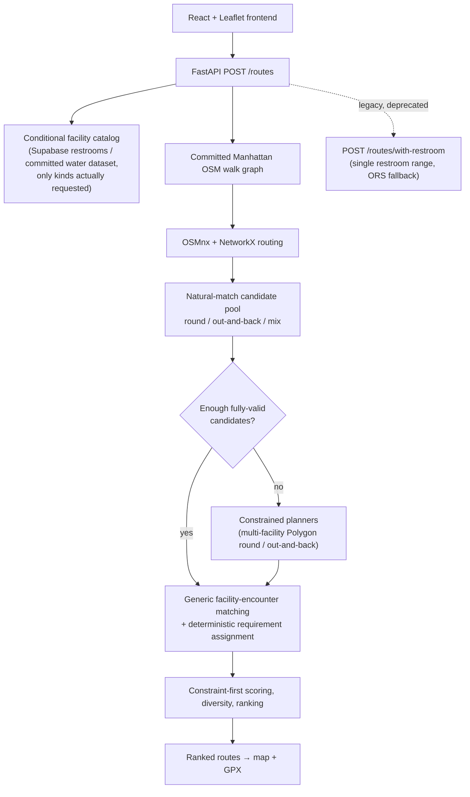

# Aware

A Manhattan running/walking route planner with a custom local routing engine — routes are generated to hit a target distance, pass any number of requested restroom and/or water stops within their own requested mile ranges, and match a requested shape, then ranked and returned with GPX export.

<!-- TODO: add product demo GIF -->

Runners planning longer routes often have to manually cross-reference maps, restroom/water locations, and distance estimates. Aware treats facility access as a routing constraint instead of a map overlay, generating routes that are built around it from the start — including routes with several stops (e.g. a restroom around mile 2-4, a water stop around mile 6-8, and another restroom around mile 9-11 on a single run).

<!-- TODO: add live demo URL once verified -->
GitHub: [Oryag910/Aware-Route](https://github.com/Oryag910/Aware-Route)

## What it does

- Target running/walking distance, tuned toward the requested value
- Any number of typed facility requirements, each with its own mile range (e.g. "a restroom between mile 2 and 4, water between mile 6 and 8") — or none at all
- Route shape: round trip, out-and-back, or mixed
- Ranked route alternatives, not just a single result
- Every requested stop shown per-route with its own satisfied/unsatisfied status, matched facility name, and cumulative mile marker
- GPX export for use in other running/GPS apps

## How it works



The local engine (OSMnx + NetworkX against a committed graph artifact) is the only engine behind the current `/routes` endpoint — the old ORS pipeline can't truthfully honor an arbitrary typed list of cumulative-mile stops, so it's never used there. The deprecated `/routes/with-restroom` endpoint keeps its original single-restroom-range contract and ORS-fallback behavior for backward compatibility, but the frontend no longer calls it.

## Routing engine

This is the core of the project, not a wrapper around a third-party directions API.

- A Manhattan pedestrian walk graph is built from OpenStreetMap data via OSMnx and committed as a graph artifact, so the app loads it once at startup instead of fetching/building a graph per request.
- Shortest-path and distance computations run on that graph with NetworkX (Dijkstra-based).
- Custom generators produce round-trip, out-and-back, and multi-anchor Polygon-loop candidates.
- A length-tuning pass drives candidates toward the requested target distance.
- Quality guards reject severely retraced candidates that would violate the requested route shape (e.g. a "round" request degenerating into a near out-and-back).
- Final candidates are deduplicated and similarity-penalized to reduce near-duplicate alternatives.

### Generic multi-facility routing

`POST /routes` accepts a variable-length list of typed facility requirements (`restroom` / `water`, each with its own mile range) instead of a single restroom range — from zero stops up to a configurable safety ceiling, not a low product-level limit.

- **Conditional data loading**: the facility catalog only fetches the kinds actually requested — a no-facility or water-only request never touches Supabase, and a request with no water requirement never loads the water dataset.
- **Natural-match-first**: an ordinary candidate pool (the same generation the no-facility path uses) is generated and scored first — many requests are satisfied by a route that already happens to pass the requested stops, without paying for constrained search.
- **Facility-encounter matching**: rather than giving every physical facility a single mile marker, the matcher projects each facility onto every segment of the FINISHED route geometry and groups contiguous near-segments into distinct "encounters" — so a facility genuinely passed twice (e.g. outbound and again on the return leg of an out-and-back) is correctly represented as two independent encounters, not one.
- **Deterministic requirement assignment**: a min-cost bipartite matching (exact facility-kind only, one encounter can satisfy at most one requirement) assigns encounters to requirements, independent of the order requirements were submitted in.
- **Constrained planners**: when natural matching alone isn't enough, a bounded beam search proposes candidates that route through the requested facilities directly — a generalized multi-anchor Polygon loop for round requests, and a corridor-based outbound/return planner for out-and-back requests. Neither ever splices a length-tuner spur onto the route; search is bounded by fixed shortlist/beam/full-build budgets independent of `facilities ^ requirements`.
- **Constraint-first scoring**: a route is only "fully valid" if its distance is within tolerance AND every requirement is strictly satisfied against the *finished* route's actual cumulative distance — never a synthetic template estimate or shortest-path-from-start proxy. Partial results are always labeled honestly (`constraints_satisfied=false`), never silently upgraded.

## Validation

The backend ships with two deterministic local-engine benchmarks.

**Legacy no-facility/single-fountain suite** (537 scenarios, unchanged by the multi-facility work below — the ordinary no-facility candidate generation code it exercises is byte-for-byte untouched). Re-run alone, with no other process competing for CPU, for a clean measurement: [`backend/benchmarks/local/report_20260820_185555.md`](backend/benchmarks/local/report_20260820_185555.md).

| Metric | Result |
|---|---|
| Scenarios with ≥1 route within ±100 m of target | **537 / 537** |
| Disconnected candidates | **0** |
| Median local route generation time | **0.245 s** |
| p95 local route generation time | **1.290 s** — identical to the pre-branch baseline (< 2.0 s production gate) |
| Max local route generation time | **2.367 s** |
| Offline bundled-fountain placement checks | **268 / 268** |

The 537/537 figure is scenario-level success (at least one qualifying route per scenario). An earlier rerun of this benchmark showed a higher p95 (1.482s) while sharing the machine with two other CPU-heavy background jobs; this clean, isolated rerun's p95 matches the original baseline exactly, confirming that delta was measurement noise, not a regression.

**New generic facility-routing benchmark** (`scripts/benchmark_facilities.py`, a separate suite that does not replace the one above), 201 scenarios across three strata, run alone for clean timing. Full report: [`backend/benchmarks/facilities/report_20260820_191140.md`](backend/benchmarks/facilities/report_20260820_191140.md).

Every latency figure below is exactly **one** end-to-end `plan_routes` call with the production-default constrained planners — the same call a real `POST /routes` request makes. A separate natural-match-only diagnostic call (used only to measure how often natural matching alone would have sufficed) is timed independently and never folded into these numbers.

**Stratum A — mechanism/correctness** (synthetic fixtures placed exactly where a real reference route's own geometry passes at the target mile marker — proves the encounter/assignment/scoring *mechanism* can honor a cumulative-mile stop):

| Requirement count | Fully constraint-valid | Per-requirement satisfaction | Median latency |
|---|---|---|---|
| 0 | 9/9 | n/a | 0.28s |
| 1 | 27/27 | 100.0% | 1.44s |
| 2 | 27/27 | 100.0% | 1.51s |
| 3-4 | 24/27 (88.9%) | 88.9% | 3.03s |
| 5-6 | 21/27 (77.8%) | 85.2% | 2.64s |

**Stratum B — planner-stress** (facility fixtures placed at real graph nodes near the requested cumulative distance's *radial* position rather than on any ordinary candidate's own path, and explicitly rejected/re-picked if a natural pool already covers them — this is the number that actually measures whether the constrained planners pull their weight, not Stratum A's, since Stratum A's fixtures are natural-match-friendly by construction):

| Requirement count | Fully constraint-valid | Constrained planner needed & recovered | Median latency |
|---|---|---|---|
| 1 | 18/18 (100%) | 18/18 (100%) | 2.87s |
| 2 | 0/18 (0%) | 0/18 (0%) | 7.26s |
| 3-4 | 0/18 (0%) | 0/18 (0%) | 11.86s |
| 5-6 | 0/18 (0%) | 0/18 (0%) | up to 19.03s |

The constrained planners reliably recover a **single** genuinely-hard (non-naturally-covered) requirement, but **0% of the time** with 2 or more simultaneously — verified by manual inspection, not assumed: the top-ranked candidate in these cases is a distance-accurate natural match satisfying nothing, while the constrained planner's best attempt reaches one of the requested facilities only by blowing past the distance target by roughly 2x. The scorer's own priority order (distance-within-tolerance ranks above requirement-satisfaction count, per this project's own spec) correctly keeps the accurate-but-unsatisfying route on top rather than surfacing a wildly-off-distance partial match — this is the scorer working as designed, not a planner bug, and it honestly reveals the current bounded beam-search planners' real capability ceiling on hard multi-stop requests. See the full report for the exact reproduction.

**Stratum C — real committed water-dataset coverage** (no synthetic placement at all — the actual bundled OSM water extract, deterministic starts, water-only): **12/12** scenarios fully satisfied, **18/18** individual water requirements found (median 3.9s). This is a small, deliberately narrow sample (2 starts × 3 distances × 1-2 requirements) — a coverage measurement, not a claim about geography elsewhere in Manhattan. Restrooms are live-Supabase-only and are not represented in any offline/committed benchmark.

The four canonical product scenarios from the project spec are automated as integration tests in [`backend/tests/test_canonical_scenarios.py`](backend/tests/test_canonical_scenarios.py) and pass against the real committed graph with injected, deterministic facility fixtures, with full requirement satisfaction.

## Tech stack

**Backend:** Python, FastAPI, OSMnx, NetworkX, Supabase, pytest, Ruff, mypy (strict)

**Frontend:** React 19, TypeScript, Vite, Leaflet / react-leaflet, Tailwind CSS

**Infrastructure:** Render (backend), Vercel (frontend), GitHub Actions CI, OpenRouteService (fallback only)

## Local development

### Backend

```bash
cd backend
python3 -m venv .venv
source .venv/bin/activate
pip install -r requirements.txt
uvicorn app.main:app --reload --reload-dir app
```

Health check: `http://localhost:8000/health`

Environment variables (`backend/.env`):

- `SUPABASE_URL`, `SUPABASE_KEY` — required for restroom data; only fetched when a request actually includes a restroom requirement (`POST /routes`) or unconditionally by the legacy `POST /routes/with-restroom`
- `ROUTING_ENGINE=local` — runs the local OSMnx/NetworkX engine for `/routes/with-restroom` (production default); unset or `ors` uses the OpenRouteService pipeline instead for that endpoint. `POST /routes` always uses the local engine regardless of this flag — see "Generic multi-facility routing" above
- `ORS_API_KEY` — only required when `ROUTING_ENGINE=ors`, or to keep `/routes/with-restroom`'s fallback path functional
- `ALLOWED_ORIGINS` — comma-separated CORS origins; unset means no CORS headers (fine for local dev via the Vite proxy)

Water-fountain data is a committed dataset (`backend/data/fountains.json`), not a live external source — no extra configuration needed.

### Frontend

```bash
cd frontend
npm install
npm run dev
```

Runs at `http://localhost:5173`, proxying `/api/*` to the local backend in dev.

## Testing & CI

GitHub Actions runs on every PR and push to `main`:

- Backend: `pytest`, `ruff check`, `mypy` (strict)
- Frontend: `eslint`, production `vite build`

## Deployment

- **Frontend** is deployed on Vercel from `frontend/`. Deployed builds (production and previews) always call relative `/api/*` paths; `vercel.json` proxies those server-side to the Render backend, so the browser stays same-origin and never depends on Render CORS allowing each ephemeral Vercel preview hostname. `VITE_API_URL` is a local-dev-only override (see "Local development" above) — it has no effect on deployed builds.
- **Backend** is deployed on Render via `render.yaml` (Docker), with `ROUTING_ENGINE=local` set so the local engine is `/routes/with-restroom`'s production path; `ORS_API_KEY` remains configured for that endpoint's fallback. `POST /routes` always uses the local engine and never falls back to ORS.
- `ALLOWED_ORIGINS` on the backend is only needed for direct cross-origin access (e.g. local dev pointed at the deployed backend); the deployed frontend itself goes through the same-origin Vercel proxy above, not direct CORS.
- The public demo is rate-limited (per-IP and global) to keep it usable at low cost.

## Limitations

- Currently scoped to Manhattan only.
- Public restroom data can be incomplete, outdated, or wrong about hours/availability.
- Water-fountain data is a static, committed OSM extract — no live "closed for the season"/maintenance signal.
- Routes are distance-tuned within a tolerance, not guaranteed-exact.
- Requests with several simultaneous facility requirements are honest best-effort, and — measured, not hand-waved — meaningfully weaker than a single hard requirement: the Stratum B planner-stress benchmark shows the constrained planners recover a single genuinely-hard (non-naturally-satisfiable) requirement 100% of the time, but 0% of the time with 2 or more simultaneously, because the scorer correctly refuses to sacrifice distance accuracy for partial facility credit (see `backend/benchmarks/facilities/` for the full breakdown and a verified explanation, not a guess). A route with unmet requirements is always returned as `constraints_satisfied=false`, never silently upgraded. Improving multi-hard-requirement recovery would need real planner/search work (larger budgets, smarter joint placement), not just tuning constants.
- No live turn-by-turn navigation or run tracking.
- The benchmark validates graph-network routing correctness and offline fountain placement; it does not independently verify every crossing, ferry, or water-adjacency condition beyond what the committed walk graph encodes.

## Data & attribution

- Routing and facility data is derived from OpenStreetMap — © OpenStreetMap contributors.
- OSM-derived data (the committed walk graph, `fountains.json`, `interruptions.json`) is governed by the Open Data Commons Open Database License (ODbL), separately from this repo's source-code license — see [`DATA_LICENSE.md`](DATA_LICENSE.md).
- The map's basemap is [OpenFreeMap](https://openfreemap.org)'s Positron vector style, rendered via MapLibre GL JS.
- Full attribution details: [`ATTRIBUTION.md`](ATTRIBUTION.md).
