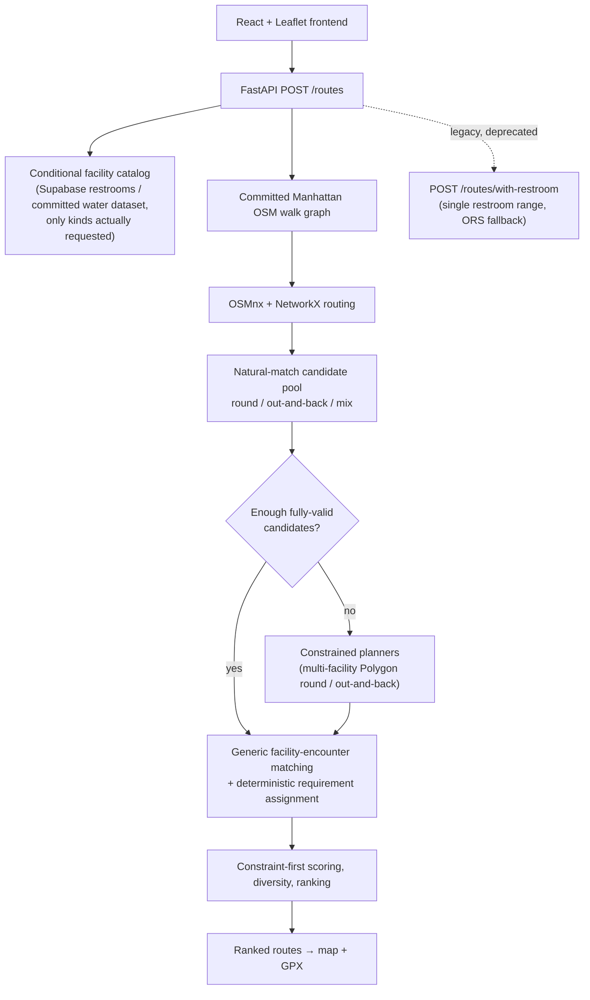

# Aware

A Manhattan running/walking route planner with a custom local routing engine — routes are generated to hit a target distance, pass any number of requested restroom and/or water stops within their own requested mile ranges, and match a shape and elevation preference, then ranked and returned with GPX export.

<!-- TODO: add product demo GIF -->

Runners planning longer routes often have to manually cross-reference maps, restroom/water locations, and distance estimates. Aware treats facility access as a routing constraint instead of a map overlay, generating routes that are built around it from the start — including routes with several stops (e.g. a restroom around mile 2-4, a water stop around mile 6-8, and another restroom around mile 9-11 on a single run).

<!-- TODO: add live demo URL once verified -->
GitHub: [Oryag910/Aware-Route](https://github.com/Oryag910/Aware-Route)

## What it does

- Target running/walking distance, tuned toward the requested value
- Any number of typed facility requirements, each with its own mile range (e.g. "a restroom between mile 2 and 4, water between mile 6 and 8") — or none at all
- Route shape: round trip, out-and-back, or mixed
- Elevation preference: flat, moderate, hilly, or any
- Ranked route alternatives, not just a single result
- Every requested stop shown per-route with its own satisfied/unsatisfied status, matched facility name, and cumulative mile marker
- GPX export for use in other running/GPS apps

## How it works



The local engine (OSMnx + NetworkX against a committed graph artifact) is the only engine behind the current `/routes` endpoint — the old ORS pipeline can't truthfully honor an arbitrary typed list of cumulative-mile stops, so it's never used there. The deprecated `/routes/with-restroom` endpoint keeps its original single-restroom-range contract and ORS-fallback behavior for backward compatibility, but the frontend no longer calls it.

## Routing engine

This is the core of the project, not a wrapper around a third-party directions API.

- A Manhattan pedestrian walk graph is built from OpenStreetMap data via OSMnx and committed as a graph artifact, so the app loads it once at startup instead of fetching/building a graph per request.
- Shortest-path and distance computations run on that graph with NetworkX (Dijkstra-based).
- Custom generators produce round-trip, out-and-back, and multi-anchor Polygon-loop candidates.
- A length-tuning pass drives candidates toward the requested target distance.
- Quality guards reject severely retraced candidates that would violate the requested route shape (e.g. a "round" request degenerating into a near out-and-back).
- Final candidates are deduplicated and similarity-penalized to reduce near-duplicate alternatives.

### Generic multi-facility routing

`POST /routes` accepts a variable-length list of typed facility requirements (`restroom` / `water`, each with its own mile range) instead of a single restroom range — from zero stops up to a configurable safety ceiling, not a low product-level limit.

- **Conditional data loading**: the facility catalog only fetches the kinds actually requested — a no-facility or water-only request never touches Supabase, and a request with no water requirement never loads the water dataset.
- **Natural-match-first**: an ordinary candidate pool (the same generation the no-facility path uses) is generated and scored first — many requests are satisfied by a route that already happens to pass the requested stops, without paying for constrained search.
- **Facility-encounter matching**: rather than giving every physical facility a single mile marker, the matcher projects each facility onto every segment of the FINISHED route geometry and groups contiguous near-segments into distinct "encounters" — so a facility genuinely passed twice (e.g. outbound and again on the return leg of an out-and-back) is correctly represented as two independent encounters, not one.
- **Deterministic requirement assignment**: a min-cost bipartite matching (exact facility-kind only, one encounter can satisfy at most one requirement) assigns encounters to requirements, independent of the order requirements were submitted in.
- **Constrained planners**: when natural matching alone isn't enough, a bounded beam search proposes candidates that route through the requested facilities directly — a generalized multi-anchor Polygon loop for round requests, and a corridor-based outbound/return planner for out-and-back requests. Neither ever splices a length-tuner spur onto the route; search is bounded by fixed shortlist/beam/full-build budgets independent of `facilities ^ requirements`.
- **Constraint-first scoring**: a route is only "fully valid" if its distance is within tolerance AND every requirement is strictly satisfied against the *finished* route's actual cumulative distance — never a synthetic template estimate or shortest-path-from-start proxy. Partial results are always labeled honestly (`constraints_satisfied=false`), never silently upgraded.

## Validation

The backend ships with two deterministic local-engine benchmarks.

**Legacy no-facility/single-fountain suite** (537 scenarios, unchanged by the multi-facility work below — the ordinary no-facility candidate generation code it exercises is byte-for-byte untouched): [`backend/benchmarks/local/report_20260820_174310.md`](backend/benchmarks/local/report_20260820_174310.md).

| Metric | Result |
|---|---|
| Scenarios with ≥1 route within ±100 m of target | **537 / 537** |
| Disconnected candidates | **0** |
| Median local route generation time | **~0.27 s** |
| p95 local route generation time | **~1.48 s** (< 2.0 s production gate) |
| Offline bundled-fountain placement checks | **268 / 268** |

The 537/537 figure is scenario-level success (at least one qualifying route per scenario). The fountain-placement figure validates against the offline bundled fountain dataset, not live Supabase restroom data — see the report for the full defect-rate and diversity breakdown.

**New generic facility-routing benchmark** (`scripts/benchmark_facilities.py`, a separate suite that does not replace the one above): synthetic facility fixtures derived from a real reference route's own geometry at the target mile marker (proves the mechanism can honor a given cumulative-mile stop, independent of where real-world restrooms/water happen to sit), across distance × shape × requirement-count × composition axes, 180 scenarios. Full report: [`backend/benchmarks/facilities/report_20260820_174951.md`](backend/benchmarks/facilities/report_20260820_174951.md).

| Requirement count | Fully constraint-valid | Per-requirement satisfaction | Median latency* |
|---|---|---|---|
| 0 | 18/18 | n/a | 0.61s |
| 1 | 54/54 | 100.0% | 1.86s |
| 2 | 54/54 | 100.0% | 2.01s |
| 3-4 | 51/54 (94.4%) | 94.4% | 3.70s |

\* Every latency figure here is ~2x a single production `/routes` call — this benchmark calls the planner twice per scenario (natural-match-only, then with constrained planners) to also measure how often each path is needed. Real single-call no-facility production latency is the legacy benchmark's ~0.27s median above, unaffected by this branch. Across all 162 scenarios with requirements: natural matching alone was sufficient **90.7%** of the time; the constrained planners were needed and succeeded another **7.4%**; **1.9%** still fell short of full validity even after the constrained planners ran (labeled `constraints_satisfied=false`, never silently upgraded).

This benchmark validates the mechanism against synthetic, graph-derived fixtures (STRATUM A) — it does not measure how often real-world restroom/water data happens to support a given request (restrooms are live-Supabase-only and are not represented offline here). The four canonical product scenarios from the project spec are automated as integration tests in [`backend/tests/test_canonical_scenarios.py`](backend/tests/test_canonical_scenarios.py) and pass against the real committed graph with injected, deterministic facility fixtures, with full requirement satisfaction.

## Tech stack

**Backend:** Python, FastAPI, OSMnx, NetworkX, Supabase, pytest, Ruff, mypy (strict)

**Frontend:** React 19, TypeScript, Vite, Leaflet / react-leaflet, Tailwind CSS

**Infrastructure:** Render (backend), Vercel (frontend), GitHub Actions CI, OpenRouteService (fallback only)

## Local development

### Backend

```bash
cd backend
python3 -m venv .venv
source .venv/bin/activate
pip install -r requirements.txt
uvicorn app.main:app --reload --reload-dir app
```

Health check: `http://localhost:8000/health`

Environment variables (`backend/.env`):

- `SUPABASE_URL`, `SUPABASE_KEY` — required for restroom data; only fetched when a request actually includes a restroom requirement (`POST /routes`) or unconditionally by the legacy `POST /routes/with-restroom`
- `ROUTING_ENGINE=local` — runs the local OSMnx/NetworkX engine for `/routes/with-restroom` (production default); unset or `ors` uses the OpenRouteService pipeline instead for that endpoint. `POST /routes` always uses the local engine regardless of this flag — see "Generic multi-facility routing" above
- `ORS_API_KEY` — only required when `ROUTING_ENGINE=ors`, or to keep `/routes/with-restroom`'s fallback path functional
- `ALLOWED_ORIGINS` — comma-separated CORS origins; unset means no CORS headers (fine for local dev via the Vite proxy)

Water-fountain data is a committed dataset (`backend/data/fountains.json`), not a live external source — no extra configuration needed.

### Frontend

```bash
cd frontend
npm install
npm run dev
```

Runs at `http://localhost:5173`, proxying `/api/*` to the local backend in dev.

## Testing & CI

GitHub Actions runs on every PR and push to `main`:

- Backend: `pytest`, `ruff check`, `mypy` (strict)
- Frontend: `eslint`, production `vite build`

## Deployment

- **Frontend** is deployed on Vercel from `frontend/`. Deployed builds (production and previews) always call relative `/api/*` paths; `vercel.json` proxies those server-side to the Render backend, so the browser stays same-origin and never depends on Render CORS allowing each ephemeral Vercel preview hostname. `VITE_API_URL` is a local-dev-only override (see "Local development" above) — it has no effect on deployed builds.
- **Backend** is deployed on Render via `render.yaml` (Docker), with `ROUTING_ENGINE=local` set so the local engine is `/routes/with-restroom`'s production path; `ORS_API_KEY` remains configured for that endpoint's fallback. `POST /routes` always uses the local engine and never falls back to ORS.
- `ALLOWED_ORIGINS` on the backend is only needed for direct cross-origin access (e.g. local dev pointed at the deployed backend); the deployed frontend itself goes through the same-origin Vercel proxy above, not direct CORS.
- The public demo is rate-limited (per-IP and global) to keep it usable at low cost.

## Limitations

- Currently scoped to Manhattan only.
- Public restroom data can be incomplete, outdated, or wrong about hours/availability.
- Water-fountain data is a static, committed OSM extract — no live "closed for the season"/maintenance signal.
- Routes are distance-tuned within a tolerance, not guaranteed-exact.
- Requests with several simultaneous facility requirements (especially requirements spread across most of the route) are honest best-effort: the constrained planners are a bounded heuristic search on real, non-uniform street topology, not a guarantee every request is fully satisfiable — a route with unmet requirements is always returned as `constraints_satisfied=false`, never silently upgraded. See `backend/benchmarks/facilities/` for measured satisfaction rates by requirement count.
- No live turn-by-turn navigation or run tracking.
- The benchmark validates graph-network routing correctness and offline fountain placement; it does not independently verify every crossing, ferry, or water-adjacency condition beyond what the committed walk graph encodes.
