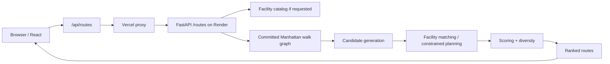

# Architecture

How Aware Route turns a start point, a target distance, and an optional set of facility requirements into ranked, GPX-exportable routes.

## System overview



Infrastructure detail (Vercel/Render wiring, PR previews, CI) lives in [`deployment.md`](deployment.md); this document is about what happens once a request reaches the FastAPI app.

## Route request

The current `/routes` endpoint accepts a single request model:

```python
class RouteRequest(BaseModel):
    start_lat: float
    start_lon: float
    target_distance_m: float          # > 0
    facility_requirements: list[FacilityRequirementIn]  # up to 20, default []
    shape: Literal["round", "out_and_back", "mix"] = "mix"
    count: int = 3                    # 1-5
    run_time: datetime | None = None
```

Each `FacilityRequirementIn` is typed (`restroom` or `water`) and carries its own cumulative-mile window (`min_distance_m` / `max_distance_m`) — a request can ask for several requirements at once, each with an independent window, e.g. a restroom around mile 2-4 and water around mile 6-8. There is no elevation-preference or workout-type input; the product doesn't expose either today.

A deprecated `/routes/with-restroom` endpoint still exists for backward compatibility with an older single-restroom-range contract and isn't called by the current frontend — see [`deployment.md`](deployment.md) for its one remaining role.

## Manhattan walk graph

The routable network is a pedestrian graph built once, offline, from OpenStreetMap via [OSMnx](https://osmnx.readthedocs.io/) (`network_type="walk"`, so motorways, ferries, and `foot=no` ways are excluded by construction, not filtered at request time). The result is committed to the repo as a versioned artifact (`backend/data/manhattan_walk_graph.v1.pkl`) with a manifest (`manhattan_walk_graph.v1.manifest.json`) recording its SHA-256, node/edge counts, schema version, and the OSMnx/NetworkX versions it was built with.

The app loads this artifact once at startup rather than rebuilding or fetching a graph per request — at roughly 36k nodes and 115k edges, that's the difference between a request paying network/build latency and paying none. On load, the manifest's SHA-256 and node/edge counts are re-verified against the actual file (within a small tolerance) and a shortest-path smoke test runs before the graph is considered ready; a corrupted or mismatched artifact fails loudly instead of serving silently-wrong routes.

Shortest-path and cumulative-distance computations run directly on this graph with NetworkX's Dijkstra implementation (`single_source_dijkstra`, `shortest_path`, edge weight `"length"`). There's no external directions API in this path — see [Important design decisions](#important-design-decisions).

Committed data provenance and licensing are documented separately in [`backend/data/README.md`](../backend/data/README.md) and [`DATA_LICENSE.md`](../DATA_LICENSE.md).

## Candidate generation

A shortest path answers "how do I get from A to B," not "give me a 5-mile loop." Reaching a target distance and shape needs its own generation step:

- **Round** and **out-and-back** candidates come from turnaround-based generators that pick diverse bearings around the start point, then a tuning pass (`tune_generator_pairs_to_target`) binary-searches a radius scale and splices a short out-and-back spur to close any remaining gap, converging on the requested distance within a 100 m tolerance.
- A **mixed** request pools both round and out-and-back candidates together.
- A newer multi-anchor polygon-loop generator produces geometrically cleaner round routes, but isn't the default for ordinary requests — enabling it pushes p95 latency past this project's own production latency gate. It's used today specifically inside the constrained facility planners (below), where routing through required stops matters more than shaving latency on the common case.

Final quality scoring also weighs pedestrian-crossing/signal density along each candidate, using a committed OpenStreetMap-derived crossing/signal dataset (`backend/data/interruptions.json`) rather than penalizing distance-only candidates that happen to route along a high-traffic corridor.

## Facility constraints

This is the harder problem: "a restroom between mile 2 and 4" only counts if it's actually encountered on the *finished* route, inside that window, measured by cumulative distance from the start — not by how close a facility happens to be to the route in a straight line.

1. **Conditional loading.** The facility catalog only fetches the kinds actually requested — a no-facility or water-only request never queries Supabase restrooms, and a request with no water requirement never loads the water dataset.
2. **Natural match first.** An ordinary candidate pool (the same generation above) is scored against the requirements before any constrained search runs, since many requests are already satisfied by a route that happens to pass the right stops.
3. **Geometry projection.** Each candidate facility is projected onto every segment of a route's *finished* geometry, not evaluated against the start point or a shortest-path proxy.
4. **Encounter grouping.** Contiguous near-segment hits are grouped into distinct "encounters" — a facility passed twice on an out-and-back (once outbound, once on the return leg) is correctly represented as two independent encounters, not one.
5. **Deterministic assignment.** A min-cost max-flow bipartite matching (`networkx.max_flow_min_cost`) assigns encounters to requirements: exact facility-kind only, and one encounter satisfies at most one requirement. Unmatched requirements get a "closest miss" explanation rather than silently disappearing.
6. **Constrained planners.** If natural matching alone doesn't produce enough fully-valid candidates, a bounded beam search proposes candidates that route through the required facilities directly — a multi-anchor polygon loop for round requests, a corridor-based planner for out-and-back. Search is bounded by fixed budgets, not exhaustive over `facilities ^ requirements`.
7. **Honest scoring.** A route is only "fully valid" if its distance is within tolerance *and* every requirement is satisfied this way. Partial results are always returned labeled `constraints_satisfied: false` — never silently upgraded to look complete.

## Ranking and diversity

Among valid candidates, alternatives are deduplicated by route-segment overlap (a Jaccard index over each route's set of undirected geometry segments) so the returned list isn't three near-identical loops. A pair below the overlap threshold counts as meaningfully distinct; selection greedily keeps the diverse ones over the ranked list, falling back to rank order when a fully diverse set isn't available. Out-and-back routes structurally retrace their own outbound leg by definition, so high self-overlap there is expected, not a defect.

## Important design decisions

| Decision | Why |
|---|---|
| Commit a versioned, checksummed graph artifact instead of building one per request | Pays the OSMnx build cost once, not per request; a corrupted artifact fails fast instead of serving silently-wrong routes |
| Local graph engine instead of a third-party directions API | An external directions API can't be asked to honor an arbitrary list of cumulative-mile stops — the constraint has to be evaluated against the app's own route geometry |
| Natural-match-first before constrained search | Most requests don't need a beam search; only pay for constrained planning when the cheap path doesn't already work |
| Finished-route geometry projection instead of a proximity/shortest-path proxy | A facility "near" the route in a straight line isn't the same as one the runner actually passes |
| Bounded search instead of exhaustive combinatorial search | Keeps latency predictable at the cost of a known limitation on several simultaneous hard requirements (see below) |
| Honest partial results instead of upgrading close misses | A route that satisfies 2 of 3 requirements is reported as such, not silently marked successful |

## Known technical boundary

The constrained planners reliably recover a single genuinely-hard facility requirement, but do not currently solve requests with two or more simultaneous hard requirements — this is a bounded-search capability ceiling, not a hidden failure mode; unmet requirements are always reported honestly. See [`benchmarks.md`](benchmarks.md) for the measured extent of this limitation.
