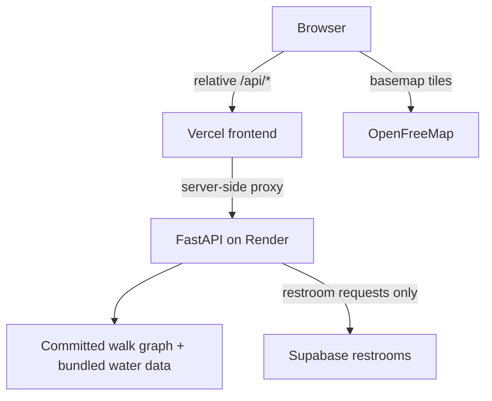

# Deployment

How the deployed system, including its per-PR preview environments, fits together.

## Production topology

The browser never calls Render directly. Every API call from the deployed frontend goes to a relative `/api/*` path on the same Vercel origin; a Vercel serverless function (`frontend/api/proxy.ts`) forwards it server-side to the configured backend. This keeps the browser same-origin regardless of which backend is behind it, and means Render's CORS configuration never has to account for Vercel's preview hostnames.

## Frontend

React + TypeScript on Vite, Node 22 (`.nvmrc`, `package.json` `engines`), deployed on Vercel. `frontend/vercel.json` rewrites `/api/:path*` to the proxy function, which reads a server-side `BACKEND_URL` environment variable (never exposed to the browser) to pick the upstream. The basemap is OpenFreeMap's Positron vector style, rendered client-side via MapLibre GL through the `@maplibre/maplibre-gl-leaflet` adapter inside the existing Leaflet/React-Leaflet map.

`VITE_API_URL` is a local-development-only override for pointing the dev server at a specific backend; it has no effect on deployed builds, which always use the relative `/api/*` path.

Production: <https://aware-route-ashen.vercel.app>

## Backend

FastAPI running in Docker on Render (`render.yaml`, `backend/Dockerfile`), health-checked at `/health`. The Manhattan walk graph and bundled water dataset are loaded from artifacts committed to the repo, so a cold container has everything it needs except live restroom data, which is fetched from Supabase only when a request includes a restroom requirement.

`/routes`, the current product endpoint, always uses the local graph engine; it never depends on `ROUTING_ENGINE` and never falls back to an external directions API. `ROUTING_ENGINE=local` in `render.yaml` governs only the deprecated `/routes/with-restroom` endpoint, which still falls back to OpenRouteService if the local engine is unavailable. That's a compatibility path for the older contract, not part of the current architecture (see [`architecture.md`](architecture.md)).

A single-process, in-memory rate limiter protects the public demo: 10 requests per IP per hour, 90 requests globally per day, returning `429` once exceeded.

## PR preview architecture

Render is configured to generate PR service previews automatically (`render.yaml`: `previews.generation: automatic`), giving each open PR its own backend instance at its own Render URL. A GitHub Actions workflow, `.github/workflows/pr-preview-sync.yml`, wires that preview backend to the matching Vercel preview frontend:

1. Triggered by a `deployment_status` event (fired when Render posts a deployment status for a PR's service preview).
2. Resolves which open PR that deployment belongs to, by matching the deployment's commit SHA against open PRs' head commits.
3. Upserts a `BACKEND_URL` environment variable in Vercel, scoped to `preview` deployments *and that PR's specific branch*, pointing at the new Render preview URL.
4. If a Vercel preview deployment for that branch already exists, triggers a redeploy so the proxy function picks up the updated `BACKEND_URL`.

The result: a PR's Vercel preview talks to that PR's own Render preview backend, not production, through the same relative `/api/*` proxy path production uses, just with a different `BACKEND_URL` behind it. Production Vercel and Render are untouched by this workflow.

## CI

`.github/workflows/ci.yml` runs on every PR and push to `main`:

- **Backend:** Python 3.14, `pytest`, `ruff check .`, `mypy app tests scripts`
- **Frontend:** Node 22, `npm ci`, `eslint .`, production `vite build`

## Environment variables

| Variable | Service | Required when |
|---|---|---|
| `SUPABASE_URL`, `SUPABASE_KEY` | Backend | A request includes a restroom requirement |
| `ROUTING_ENGINE` | Backend | Only affects the deprecated `/routes/with-restroom` endpoint; `/routes` always uses the local engine |
| `ORS_API_KEY` | Backend | Only for `/routes/with-restroom`'s OpenRouteService fallback |
| `ALLOWED_ORIGINS` | Backend | Direct cross-origin access to the backend (not needed for the deployed frontend, which stays same-origin through the Vercel proxy) |
| `BACKEND_URL` | Frontend (Vercel, server-side only) | Always: selects which backend the proxy function forwards to; production and each PR preview have their own value |
| `VITE_API_URL` | Frontend (local dev only) | Optional local override; unused in deployed builds |

No values are listed here or anywhere in this repository's public documentation.

## Operational tradeoffs

- Render's free-tier service can cold-start after inactivity; the first request after idle time is noticeably slower than steady-state.
- The public demo is rate-limited (above) to keep it usable at low cost rather than fully unbounded.
- OpenFreeMap is an external, unauthenticated basemap dependency; the walk graph and water data are local artifacts specifically to avoid that same kind of runtime dependency for routing itself.
- Supabase is a live dependency only for restroom requests; a no-facility or water-only request never touches it.
